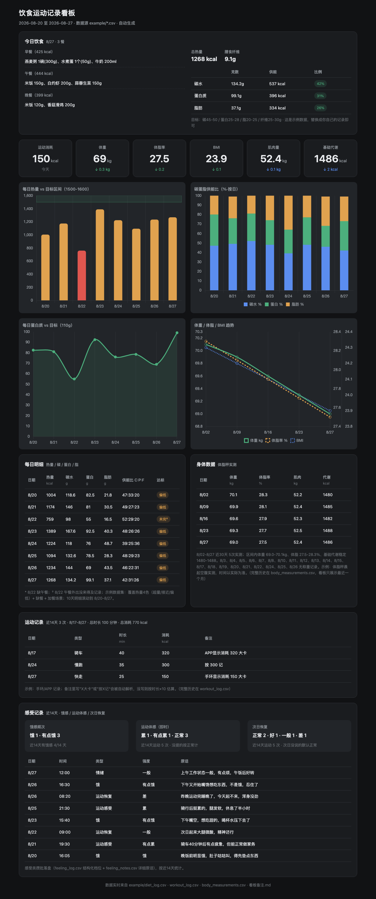

# 饮食运动看板生成器（Diet Dashboard Generator）

> 把每天吃的、练的、称的（CSV），一键变成一张深色风格的数据看板。纯本地运行，不依赖任何服务端。

  

## 这是为什么而做的

减脂和运动，最核心的两个步骤是 **记录** 和 **调整**：

- **没有记录，就没有办法好好调整。** 不知道吃了多少、练了多少、身体怎么回应，"调整"就只能是拍脑袋。
- **没有调整，就是乱减。** 要么极端节食、猛猛训练，把自己逼到墙角；要么暴饮暴食、完全不动，然后自责、反弹。
- **记录 + 调整，帮你在两个极端之间找到平和的心态。** 数据是真相：今天吃多了，明天收一点；今天没练，明天补上。不因为一天波动就否定自己。

这个工具，就是把「记录」这件事做到最简单（改 CSV → 跑一条命令 → 看板刷新），把「调整」这件事变得有依据（热量、蛋白质、趋势、缺口一目了然）。

## 效果预览

用示例数据生成的看板（仓库里的 `example/` 可直接复现）：



## 它能做什么

喂给它 3 个 CSV（饮食 / 体重 / 运动），它自动生成一张完整的 HTML 看板：

- **今日饮食面板**：早餐→午餐→晚餐→加餐，每餐带热量，右侧总热量 + 碳蛋脂供能比 + 达标情况
- **6 张小卡**：运动消耗、体重、体脂率、BMI、肌肉量、基础代谢（带涨跌箭头）
- **4 张图表**：每日热量 vs 目标区间 / 碳蛋脂供能比 / 每日蛋白质 vs 目标 / 体重体脂BMI趋势
- **窗口化明细**：每日明细/图表显示最近 10 天，运动记录/感受板块显示近 14 天（两周），身体数据表/趋势图显示最近 30 天（一个月）——**CSV 全量留存，看板只是最近窗口的投影**
- **身体数据表 + 运动记录**：自动统计 + 窗口化
- **感受记录板块**：近 14 天饿感频次、运动后即时体感、次日恢复情况的自动统计（数据来自 `feeling_log.csv`）

日常用法：**改 CSV → 跑一条命令 → 看板刷新**。适合"只记录、不折腾"的人——把数据当真相，看板永远是数据的投影。

## 快速开始

### 0. 前置
- Python 3（无第三方依赖，只用标准库）
- Chart.js 两个文件（首次下载，见第 3 步）

### 1. 准备数据目录

复制示例，替换成你自己的记录：

```bash
git clone <本仓库> && cd diet-dashboard-generator
cp -r example mydata   # 建自己的数据目录
# 用文本编辑器把 mydata/*.csv 换成你的数据（格式见下文）
```

### 2. 下载 Chart.js（一次性）

看板图表引用 `vendor/` 下的两个本地文件（不打包进仓库，避免 repo 臃肿）：

```bash
mkdir -p mydata/vendor
curl -L -o mydata/vendor/chart.umd.min.js \
  https://cdn.jsdelivr.net/npm/chart.js@4.4.3/dist/chart.umd.min.js
curl -L -o mydata/vendor/chartjs-plugin-annotation.min.js \
  https://cdn.jsdelivr.net/npm/chartjs-plugin-annotation@3.0.1/dist/chartjs-plugin-annotation.min.js
```

> 如果 CDN 不可达，也可以去 [chart.js](https://www.jsdelivr.com/package/npm/chart.js) 和 [chartjs-plugin-annotation](https://www.jsdelivr.com/package/npm/chartjs-plugin-annotation) 的页面手动下载同名文件。

### 3. 生成看板

```bash
python3 generate_dashboard.py --data-dir mydata
# 已生成 mydata/饮食运动看板.html —— 浏览器打开即可
```

之后每次更新数据，重复第 3 步即可（想换数据目录就换 `--data-dir`）。

### 先看效果（不建数据目录）

示例数据是固定历史日期，演示时用 `--today` 指定"今天"：

```bash
python3 generate_dashboard.py --data-dir example --today 2026-08-27
open example/饮食运动看板.html   # macOS
```

## 数据格式

列顺序固定，**不要改表头**。三份 CSV 均支持 UTF-8（含 BOM 也兼容）。

### diet_log.csv — 每行一条食物

```csv
日期,餐次,食物,份量,热量kcal,碳水g,蛋白质g,脂肪g,膳食纤维g,备注
2026-08-27,早餐,燕麦粥,1碗(300g),220,40,8,4,4,
2026-08-27,午餐,米饭,150g,174,38,4,0.5,0.6,
```

- 餐次：`早餐` / `午餐` / `晚餐` / `加餐`（显示顺序固定；加餐多行自动合并为一条）
- 份量可留空

### body_measurements.csv — 每行一次体脂秤实测

```csv
日期,体重kg,体脂率%,备注
2026-08-27,69.0,27.5,实测：BMI 23.9 / 肌肉量 52.4kg / 基础代谢 1486
```

- 备注**必须**包含 `BMI xx.x`、`肌肉量 xx.xkg`、`基础代谢 xxxx`（脚本从备注解析，"肌肉"或"肌肉量"均可）
- ⚠️ 备注里**禁止用 ASCII 逗号 `,`**（会列错位导致解析丢失），一律用中文逗号 `，`

### workout_log.csv — 每行一次运动

```csv
日期,运动类型,时长分钟,强度,备注
2026-08-27,快走,25,低,手环显示消耗 150 大卡
```

- 消耗 kcal 解析顺序：备注里 `X大卡` → `按X记` → 都没有则按时长×10 估
- 强度列当前未使用

### feeling_log.csv（可选）— 每行一条感受记录

```csv
日期,时间,类型,强度,原话
2026-08-27,16:30,饿,有点饿,"下午开始嘴馋，其实不是饿，忍住了"
2026-08-26,21:30,运动感受,累,"骑行后挺累的，腿发软，休息了半小时"
2026-08-27,08:20,运动恢复,差,"昨晚运动完睡晚了，今天起不来"
```

- 类型：`饿` / `嘴馋` / `运动感受`（运动后即时体感）/ `运动恢复`（次日恢复）/ `情绪` / `生理` / `其他`
- 强度：饿→`饿/有点饿/无`；运动感受→`累/有点累/正常`；运动恢复→`好/一般/差`；嘴馋→`强/中/弱`（3 档）
- 看板底部「感受记录」板块会自动统计**近 14 天**：饿感频次（饿/有点饿 + 有饿感 X/14 天）；运动体感与次日恢复**以运动次数为分母、没写记录的默认按"正常"计**（累/恢复差才会说），并列出最近记录；文件缺失/为空时板块显示"暂无记录"，不影响其他部分
- ⚠️ 原话里同样**禁止用 ASCII 逗号 `,`**（用中文逗号 `，`），避免列错位

### 看板备注.md（可选）— 放 CSV 表达不了的解释

```markdown
## 未完日期
8/22: 午餐外出没来得及记录

## 今日额外说明
8/27: 今天开始低碳

## 明细底部说明
自由文本，追加到每日明细脚注

## 身体数据脚注
自由文本，追加到身体数据表脚注

## 运动脚注
自由文本，显示在运动板块脚注
```

「未完日期」「今日额外说明」只对 7 天窗口内的日期生效，滚出自动忽略。

## 配置（改脚本顶部 CONFIG）

```python
CONFIG = {
    'title': '饮食运动记录看板',          # 页面标题
    'cal_lo': 1500, 'cal_hi': 1600,      # 每日热量目标区间 kcal
    'protein_target': 110,               # 每日蛋白质目标 g
    'fiber_text': '25-30g',              # 膳食纤维目标（文案）
    'ratio_targets': {                   # 供能比目标区间 %
        '碳水': (45, 50), '蛋白质': (25, 28), '脂肪': (20, 25),
    },
}
```

改完直接跑脚本即可，看板里的目标区间、图表标题、供能比标签会跟着变。

## 命令行参数

| 参数 | 说明 | 默认 |
|---|---|---|
| `--data-dir <路径>` | 数据目录（含 CSV 与 vendor/） | 脚本所在目录 |
| `--out <路径>` | 输出 HTML 路径 | `<data-dir>/饮食运动看板.html` |
| `--today <YYYY-MM-DD>` | 演示用：指定"今天" | 系统今天 |

## 数据窗口与真相（重要）

**CSV 是唯一真相，全量留存；看板只是最近窗口的投影。**

- 所有历史记录始终完整保存在 CSV 里，**永远不会被覆盖或删除**——想查多久以前的都有
- 看板只展示最近一段：每日明细/图表 10 天、运动记录/感受 14 天、身体数据 30 天（常量 `WINDOW_DAYS` / `WORKOUT_WINDOW_DAYS` / `BODY_WINDOW_DAYS` / `FEEL_WINDOW_DAYS` 可改）
- 窗口滚动只影响"看板显示多少"，不影响"数据存了多少"

**省积分的更新节奏**：硬数据（饮食/体重/运动）每次更新后跑一次脚本；感受记录攒着写进 `feeling_log.csv`，**不单独刷看板**，等下次硬数据更新时顺带刷新（建议每天固定一次，如早上第一餐后）。一天通常只跑 1-2 次脚本。

## 内置规则（配色语义）

- 热量条形色：`>=上限` 蓝 / `区间内` 绿 / `1000-下限` 琥珀 / `<1000` 红
- 体重/体脂/BMI 箭头：**升红 降绿 持平灰**（减脂语境下有利方向为绿）
- 肌肉量/基础代谢箭头：恒蓝（不随涨跌变色）
- 运动新鲜度：0/1天灰、2天绿、3天黄、4天红、5天+紫
- 供能比 = 碳4 + 蛋4 + 脂9 能量分母，四舍五入
- 图表目标区间用 box 型 annotation（不依赖日期锚点，天然防滚动错位）

## 集成 WorkBuddy / AI 助理

仓库里的 `SKILL.md` 可以直接作为 AI 助理（如 WorkBuddy）的技能文件使用：把它连同 `generate_dashboard.py` 放到 `~/.workbuddy/skills/diet-dashboard-generator/`，AI 就能按文档"读 CSV → 跑脚本 → 展示看板"替你完成整套更新流程。

## 常见问题

**今日面板显示"今日暂无记录"？**
数据里没有"今天"的日期。示例数据是固定的历史日期，演示请加 `--today 2026-08-27`；你自己的数据里包含今天即可。

**图表区域空白？**
数据目录缺 `vendor/`（Chart.js），按"快速开始"第 2 步下载。脚本运行时会检测并提示。

**身体表肌肉/代谢为空？**
备注里没写 BMI/肌肉量/基础代谢，或备注用了 ASCII 逗号导致列错位。参见 body_measurements 格式。

**报错"缺少 xxx.csv"？**
数据目录里缺文件，检查 `--data-dir` 指向的目录是否完整。

## License

MIT（如需要其他协议，改 LICENSE 文件即可）。

---

*数据是真相，看板只是它的投影。*
